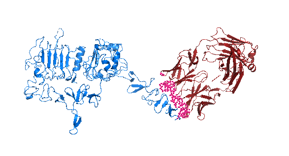
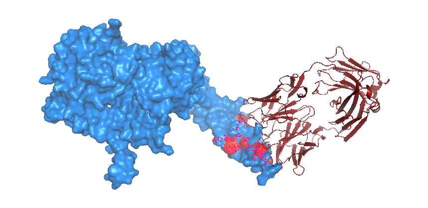
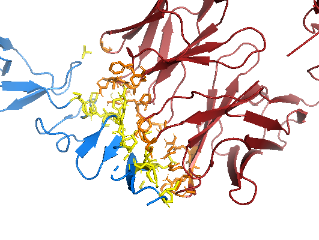
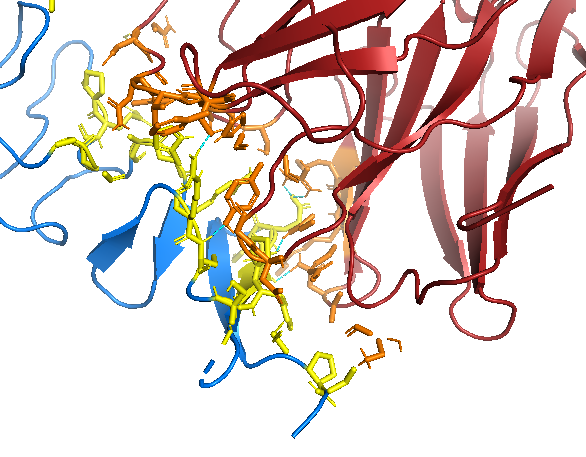
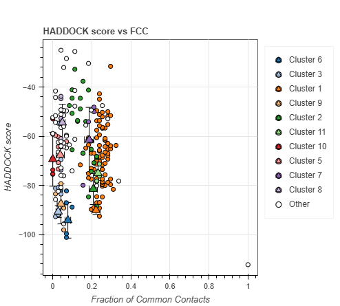
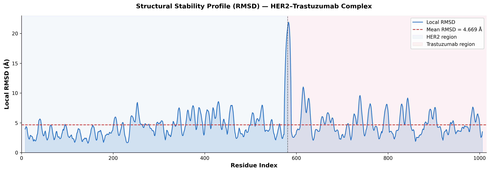
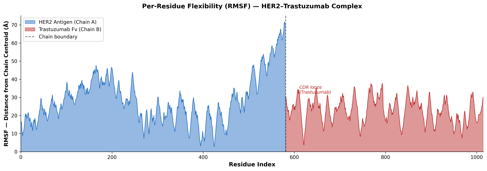

# In Silico Design and Characterization of Monoclonal Antibodies for Therapeutic Applications

<div align="center">


**A complete, end-to-end computational pipeline for antibody structure modeling, molecular docking, and structural stability characterization — targeting HER2-positive breast cancer.**


</div>

---

## 📌 Table of Contents

- [Project Overview](#-project-overview)
- [Scientific Background](#-scientific-background)
- [Pipeline Summary](#-pipeline-summary)
- [Results at a Glance](#-results-at-a-glance)
- [Repository Structure](#-repository-structure)
- [Tools and Software](#-tools-and-software)
- [Key Figures](#-key-figures)
- [How to Reproduce](#-how-to-reproduce)
- [Authors](#-authors)
- [License](#-license)
- [References](#-references)

---

## 🔬 Project Overview

This project implements a **fully validated in silico pipeline** for the design and computational characterization of **Trastuzumab (Herceptin)**, a clinically approved monoclonal antibody against its therapeutic target, **HER2 (Human Epidermal Growth Factor Receptor 2)**.

HER2 overexpression occurs in ~20% of breast cancer cases and is associated with aggressive tumor progression. Trastuzumab binds the extracellular **Domain IV** of HER2 with high specificity, blocking receptor signaling and mediating immune-mediated tumor clearance.

This pipeline covers the complete computational characterization workflow:

> **Sequence Retrieval → Homology Modeling → Structure Validation → Molecular Docking → Visualization → Structural Stability Analysis**

---

## 🧪 Scientific Background

| Item | Detail |
|------|--------|
| **Target protein** | HER2 / ErbB2 (extracellular domain, 607 residues) |
| **Reference antibody** | Trastuzumab (Herceptin) Fv fragment |
| **Crystal structure** | PDB: [1N8Z](https://www.rcsb.org/structure/1N8Z) — HER2 + Trastuzumab Fab co-crystal (2.5 Å) |
| **Epitope** | HER2 Domain IV residues: 529, 531, 543, 545, 548, 553, 557, 559, 562, 564, 568, 570, 572, 575 |
| **CDR loops (antibody)** | CDR-L1(24–34), CDR-L2(50–56), CDR-L3(89–97), CDR-H1(240–249), CDR-H2(264–279), CDR-H3(309–316) |
| **Reference** | Cho et al., *Nature* 2003, 421:756–760 |

---

## 🔁 Pipeline Summary

```
┌─────────────────────────────────────────────────────────────────┐
│                    COMPLETE IN SILICO PIPELINE                  │
├─────────────┬───────────────────────────────────────────────────┤
│  STEP 1     │  Target Selection + Data Retrieval                │
│             │  PDB: 1N8Z → VH/VL FASTA extraction               │
├─────────────┼───────────────────────────────────────────────────┤
│  STEP 2     │  Homology Modeling (SWISS-MODEL)                  │
│             │  Template: 6dez.1 | Identity: 89.63% | GMQE: 0.86 │
├─────────────┼───────────────────────────────────────────────────┤
│  STEP 3     │  Structure Validation                             │
│             │  MolProbity | ERRAT | VERIFY_3D | QMEAN           │
├─────────────┼───────────────────────────────────────────────────┤
│  STEP 4     │  Molecular Docking (HADDOCK 2.4)                  │
│             │  Score: -90.1 kcal/mol | BSA: 1992 Ų             │
├─────────────┼───────────────────────────────────────────────────┤
│  STEP 5     │  PyMOL Visualization                              │
│             │  4 publication-quality structural figures         │
├─────────────┼───────────────────────────────────────────────────┤
│  STEP 6     │  Normal Mode Analysis (iMODS)                     │
│             │  Eigenvalue | Deformability | B-factor | Variance │
├─────────────┼───────────────────────────────────────────────────┤
│  STEP 7     │  RMSD / RMSF Analysis (BioPython + Matplotlib)    │
│             │  Per-residue flexibility | Stability profile      │
└─────────────┴───────────────────────────────────────────────────┘
```

---

## 📊 Results at a Glance

### Homology Modeling Quality

| Metric | Value | Threshold | Status |
|--------|-------|-----------|--------|
| Sequence Identity | 89.63% | > 30% | ✅ Excellent |
| GMQE Score | 0.86 | > 0.7 | ✅ High quality |
| QMEANDisCo | 0.82 ± 0.05 | > 0.7 | ✅ Reliable |
| RMSD vs crystal | 0.983 Å | < 2.0 Å | ✅ Pass |

### Structure Validation

| Method | Parameter | Value | Threshold | Status |
|--------|-----------|-------|-----------|--------|
| MolProbity | Ramachandran Favored | 95.56% | > 90% | ✅ |
| MolProbity | Ramachandran Outliers | 0.47% | < 2% | ✅ |
| MolProbity | Clashscore | 2.47 | < 10 | ✅ |
| SWISS-MODEL | QMEAN Z-score | -0.45 | > -2.0 | ✅ |
| ERRAT | Quality Factor | 85.86% | > 80% | ✅ |
| VERIFY_3D | Residues ≥ 0.1 | 83.10% | > 80% | ✅ |

### Molecular Docking (HADDOCK 2.4 — Cluster 1)

| Metric | Value | Assessment |
|--------|-------|------------|
| HADDOCK Score | -90.1 ± 1.4 kcal/mol | ✅ Strong binding |
| Van der Waals Energy | -66.4 ± 5.7 kcal/mol | ✅ Strong vdW contacts |
| Electrostatic Energy | -218.8 ± 27.3 kcal/mol | ✅ Strong complementarity |
| Desolvation Energy | -19.2 ± 2.9 kcal/mol | ✅ Favorable burial |
| Buried Surface Area | 1992.2 ± 56.9 Ų | ✅ Excellent (> 1500 Ų) |
| Cluster Size | 82 structures | ✅ Excellent convergence |
| Z-Score | -1.0 | ✅ Above average |

### Structural Stability (iMODS NMA)

| Metric | Value | Interpretation |
|--------|-------|----------------|
| First Eigenvalue | 1.105870 × 10⁻⁶ | Low-energy cooperative motion |
| Variance (Mode 1) | ~48% | Dominant global mode |
| Cumulative Variance (Modes 1–3) | > 90% | Stable, coordinated complex |
| Mean RMSD (coordinate-based) | 4.669 Å | Consistent structural packing |

---

## 📁 Repository Structure

```
HER2-mAb-InSilico-Design/
│
├── 📂 data/
│   └── raw/
│       ├── HER2_Trastuzumab_1N8Z.pdb          # Reference crystal structure
│       ├── Trastuzumab_VH.fasta                # Heavy chain sequence
│       ├── Trastuzumab_VL.fasta                # Light chain sequence
│       └── Trastuzumab_VH_VL_combined.fasta    # Combined Fv sequence
│
├── 📂 modeling/
│   ├── swiss_model_results/
│   │   ├── Trastuzumab_Fv_SWISSMODEL.pdb       # Homology model output
│   │   └── SWISSMODEL_quality_report.pdf        # Full quality report
│   └── validation/
│       └── ramachandran_plot.png                # Ramachandran validation plot
│
├── 📂 docking/
│   ├── HER2_antigen_HADDOCK.pdb                # HER2 input for docking
│   ├── Trastuzumab_Fv_HADDOCK.pdb              # Antibody input for docking
│   └── HER2_Trastuzumab_docked_cluster1_best.pdb  # Best docking pose
│
├── 📂 nma_analysis/
│   └── iMODS_results/
│       ├── iMODS_bfactor.jpg                   # B-factor / RMSF profile
│       ├── iMODS_deformability.jpg             # Deformability profile
│       ├── iMODS_eigenvalues.jpg               # Eigenvalue spectrum
│       └── iMODS_variance.jpg                  # Variance per mode
│
├── 📂 analysis/
│   ├── RMSD_RMSF_Analysis.ipynb                # Python analysis notebook
│   ├── HER2_docking_visualization.pse          # PyMOL session file
│   └── figures/                                # All publication figures
│       ├── HER2_Trastuzumab_complex.png
│       ├── SWISSMODEL_antibody_model.png
│       ├── model_vs_crystal_alignment.png
│       ├── ramachandran_plot.png
│       ├── HADDOCK_score_vs_FCC.png
│       ├── HADDOCK_score_vs_iRMSD.png
│       ├── HADDOCK_VdW_boxplot.png
│       ├── HADDOCK_electrostatics_boxplot.png
│       ├── docked_complex_full.png
│       ├── binding_interface_closeup.png
│       ├── hydrogen_bonds_interface.png
│       ├── binding_pocket_surface.png
│       ├── iMODS_bfactor.jpg
│       ├── iMODS_deformability.jpg
│       ├── iMODS_eigenvalues.jpg
│       ├── iMODS_variance.jpg
│       ├── RMSD_stability_plot.png
│       └── RMSF_plot.png
│
├── 📄 README.md
└── 📄 LICENSE
```

---

## 🛠 Tools and Software

| Tool | Version | Purpose |
|------|---------|---------|
| [RCSB Protein Data Bank](https://www.rcsb.org) | — | Structure & sequence retrieval |
| [SWISS-MODEL](https://swissmodel.expasy.org) | — | Homology modeling |
| [SAVES v6.0](https://saves.mbi.ucla.edu) | — | ERRAT & VERIFY_3D validation |
| [MolProbity](http://molprobity.biochem.duke.edu) | — | Ramachandran & clashscore |
| [HADDOCK 2.4](https://haddock.science.uu.nl) | 2.4 | Protein-protein docking |
| [PyMOL](https://pymol.org) | 2.5 | Molecular visualization |
| [iMODS](https://imods.chaconlab.org) | — | Normal mode analysis |
| [BioPython](https://biopython.org) | 1.81 | PDB parsing & RMSD/RMSF |
| [Matplotlib](https://matplotlib.org) | 3.7 | Publication-quality plots |
| Python | 3.10 | Analysis scripting (Google Colab) |

---

## 🖼 Key Figures

### Docked Complex — Full View


### Binding Pocket Surface (Epitope Highlighted)

*Red patch = HER2 Domain IV epitope. Trastuzumab (dark red ribbon) docks precisely onto this patch.*

### Binding Interface — Close-up


### Hydrogen Bond Network


### HADDOCK Score vs FCC


### RMSD Stability Profile


### Per-Residue Flexibility (RMSF)


---

## 🔄 How to Reproduce

### Prerequisites
- PyMOL (free version) for visualization
- SWISS-MODEL account (free)
- HADDOCK 2.4 account (free academic registration)
- Python 3.x with BioPython and Matplotlib
- Google Colab (free, for analysis notebook)

### Step-by-Step

**1. Clone the repository**
```bash
git clone https://github.com/YOUR_USERNAME/HER2-mAb-InSilico-Design.git
cd HER2-mAb-InSilico-Design
```

**2. Install Python dependencies**
```bash
pip install biopython matplotlib numpy
```

**3. Run RMSD/RMSF analysis**
```bash
# Open analysis/RMSD_RMSF_Analysis.ipynb in Google Colab
# Upload docking/HER2_Trastuzumab_docked_cluster1_best.pdb
# Run all cells
```

**4. Open PyMOL session**
```bash
# Open PyMOL → File → Open → analysis/HER2_docking_visualization.pse
```

---

## 👨‍🔬 Authors

| Name | Role |
|------|------|
| **Vidit Jain** | Computational pipeline design, execution, analysis and reporting |
| **Shashidhar K** | Project guidance, scientific supervision and reporting |

*Developed under the Mini-Project Program (CP004/MP01) at **Bversity School of Bioscience.***

---

## 📄 License

This project is licensed under the MIT License — see the [LICENSE](LICENSE) file for details.

---

## 📚 References

1. Slamon DJ, et al. Use of chemotherapy plus a monoclonal antibody against HER2 for metastatic breast cancer. *N Engl J Med.* 2001;344(11):783–92.
2. Cho HS, et al. Structure of the extracellular region of HER2 alone and in complex with the Herceptin Fab. *Nature.* 2003;421(6924):756–60.
3. Carter P, et al. Humanization of an anti-p185HER2 antibody for human cancer therapy. *Proc Natl Acad Sci USA.* 1992;89(10):4285–9.
4. Waterhouse A, et al. SWISS-MODEL: homology modelling of protein structures and complexes. *Nucleic Acids Res.* 2018;46(W1):W296–303.
5. van Zundert GCP, et al. The HADDOCK2.2 Web Server. *J Mol Biol.* 2016;428(4):720–5.
6. Lopez-Blanco JR, et al. iMODS: internal coordinates normal mode analysis server. *Nucleic Acids Res.* 2014;42:W271–6.
7. Cock PJA, et al. Biopython: freely available Python tools for computational molecular biology. *Bioinformatics.* 2009;25(11):1422–3.
8. Berman HM, et al. The Protein Data Bank. *Nucleic Acids Res.* 2000;28(1):235–42.

---

<div align="center">


</div>
